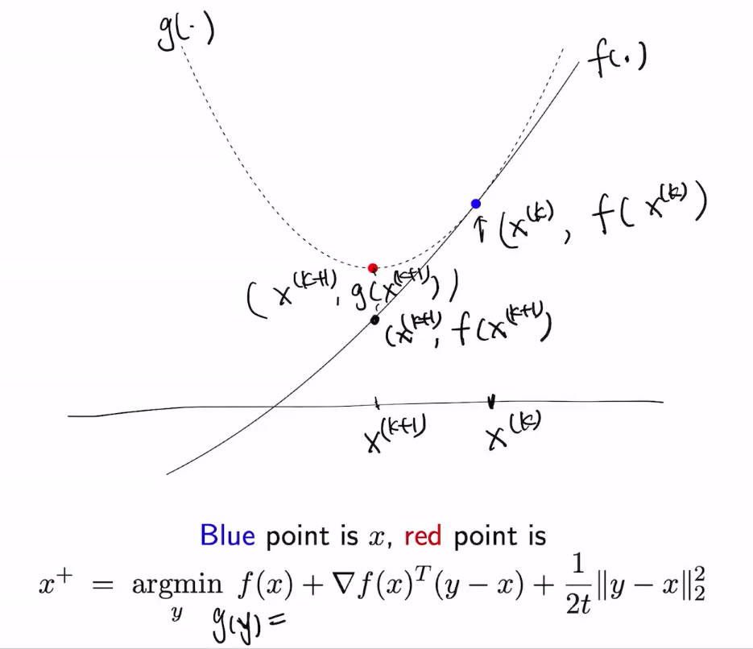
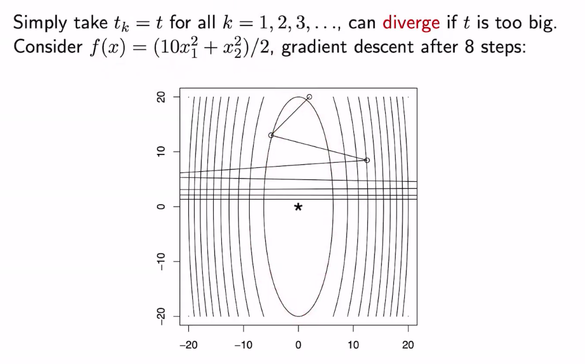
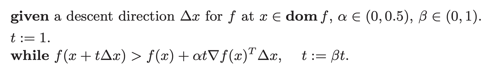
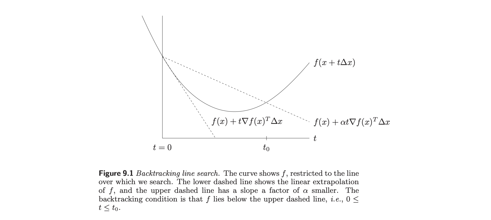
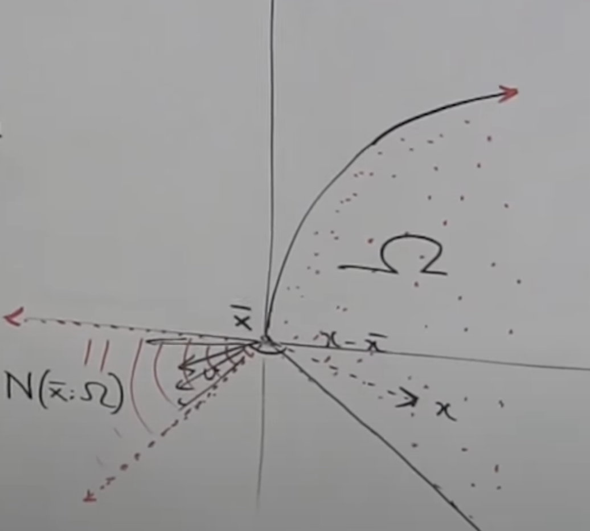

### Class 7. Gradient Descent. 

We start with the simplest problem: unconstrained convex optimization where the objective function is also differentiable. 

Suppose we have a convex, differentiable $f$ where $\text{dom} \; f = \mathbb{R}^n$. 

The **gradient descent** algorithm is: choosing an initial point $x^{(0)}$ and then doing:
$$x^{(k)} = x^{(k-1)} - t_k \cdot \nabla f(x^{(k-1)})$$
where $t_k$ is parameterized by the step number. At some point, stop. 

**Theorem**. Suppose $f$ is $M$-smooth and $\eta = t^{(k)} < \frac{1}{M}$ for all step sizes $k$. We then have that for optimal point $x^*$, $f(x^*) - f(x) \leq \frac{\|x^{(0)} - x^*\|_2^2}{2 \eta T}$. 

This means that subject to the smoothness and step conditions, we get $\epsilon$-close to the optimal in $O(1/\epsilon)$ steps. This is proved next class. 

**A Digression on Taylor Approximations.** 
Suppose we have a function $f: \mathbb{R} \to \mathbb{R}$ that is differentiable at least twice. The **first order Taylor Approximation** is 
$$\tilde{f}(y) = f(x) + \nabla f(x) (y-x)$$
If $f$ is convex, $f(\tilde{y}) \leq f(y)$ --> the FOTA is a global under-estimator. 

The **second order Taylor Approximation** is 
$$\tilde{f}(y) = f(x) + \nabla f(x)^T(y-x) + \frac{1}{2} (y-x)^T \nabla^2 f(x) (y-x)$$

The Hessian $\nabla^2 f(x)$ is expensive to compute, and this makes us sad. 

**Relating GD to an Approx Taylor Expansion.** 

Here, we show that one step of GD is equivalent to minimizing a simplified second order approximation of the function. 

Our goal in a GD step is to "take a step toward a minima." It may be unclear why GD is a principled way of doing this; we show here that one step in GD is equivalent to minimizing a simplified second-order Taylor Approximation of the function. 

Suppose right now that $x = x^{(k)}$, the $x$ position we have after $k$ steps of GD. And suppose we say the Hessian is just $\frac{1}{t} I$ where $I$ is the $n \times n$ identity matrix and $t$ is the step num. Then, let's define a new function 
$$g(y) = f(x) + \nabla f(x)^T (y-x) + \frac{1}{2t} \|y-x\|_2^2$$
This function is easy to minimize, since $\nabla g(y) = \nabla f(x) + \frac{1}{t}(y-x)$ which when set to 0 gives us analytically that 
$$\nabla f(x) + \frac{1}{t}(y^* - x) = 0 \iff y^* = x - t \nabla f(x)$$
Thus, we have that the minimum of this simplified function $y^* = x^{(k+1)}$. And we go: 
$$x^{(k)} = x^{(k-1)} - t_k \cdot \nabla f(x^{(k-1)}$$

> **Intuition**: The original function $f$ is too complex to work with. Thus, we'll iteratively work with a simplified second-order approximation of $f$, where each "iteration" we just jump to the optimal solution of the simplified second-order approximation. 

**A visual.** Note that this interpretation doesn't actually use the convexity of $f$ at all.

> **Intuition**: The First Order Approximation is a hyperplane below the function, and Second Order Approximation is a quadratic function above. We can't do much with the affine approx (hyperplane) because it has no min!

**Choosing the step size.** Using a fixed step size can cause GD to diverge. 

**Exact line search.** This is the ideal way of choosing step size, although it's not very practical. Basically, we try to find the optimal step size that minimizes the function value after the gradient step. 
$$t = \text{argmin}_{s \geq 0} f(x - s \nabla f(x))$$
Notice that the inside is an affine function of $s$, so this is still a convex function. Sometimes this is easy to solve; usually it's not. Perhaps it's reasonable to think that this single-variable optimization problem is fast to solve, compared to e.g. computing the _descent direction_ (the gradient)? Approximations to exact line search are typically not as efficient. 

**Backtracking line search.** 
- First, fix $0 < \beta < 1$ and $0 < \alpha \leq 1/2$. 
- **The Algorithm**: 
- Consider the direction of steepest descent: $-\nabla f$. We have that the second term in the `while` loop is $\alpha t \nabla f(x)^T \nabla f(x) = \alpha t \| \nabla f(x) \|_2^2$. This justifies the algorithm provided in class, which was:  
	- at each iteration, starting with $t = t_{init}$. While $f(x - t \nabla f(x)) > f(x) - \alpha t \|\nabla f(x) \|_2^2$, shrink $t = \beta t$. O/w just perform the GD update. Usually set $\alpha=\frac{1}{2}$. 
- The intuition of this method is that the function's step needs to be small enough for the step size to cause it to decrease (at all).

Visually, we have that $f(x) - \alpha t \| \nabla f(x) \|_2^2$ is the second line below. The first line is just the line of steepest descent. In our gradient update, if we overshoot, then we'll be above the second line, in which case we decrease our step size.  

### Class 8. GD. Convergence, Lipschitz Smoothness.

There are a few different error metrics we might care about:
- $\|f(x^{(k)}) - f^*\|_2^2$ 
- $f(x^{(k)}) - f^*$ 
- $\|x^{(k)} - x^*\|_2^2$

We use the second metric. We care about **convergence** and **speed of convergence**. We define the speed of convergence of error $e_k$ as:
- Sub-linear: $\lim_{k \rightarrow \infty} \frac{e_{k+1}}{e_k}=1 \quad$ e.g. $e_k=\frac{1}{k^c} \quad c>0$
- Linear: $\lim_{k \rightarrow \infty} \frac{e_{k+1}}{e_k}=\beta \in(0,1)$ e.g. $e_k=\beta^k$
- Super-linear: $\lim_{k \rightarrow \infty} \frac{e_{k+1}}{e_k}=0 \quad$ e.g. $e_k=\frac{1}{k}^k$
- Super-linear of order $\mathrm{d}: \lim_{k \rightarrow \infty} \frac{e_{k+1}}{e_k^d}=\beta \in(0,1) \quad$ e.g. $e_k=\beta^{d^k} \quad d>1$

**Remark**. For getting $\epsilon=2^{-8}$ close to a solution, a sub-linear algorithm with $e_k=\frac{1}{\sqrt{k}}$ would run for $\frac{1}{\epsilon^2}=2^{16}=65536$ iterations while a super-linear algorithm with $e_k=\frac{1}{2}^{2^k}$ will halt in $\log \log \frac{1}{\epsilon}=3$ iterations.

**Definition. Lipschitz Continuity.** If $X$ and $Y$ are Euclidean spaces, with $f: X \to Y$, then $f$ is $L$-Lipschitz continuous if $\| f(y)-f(x)\| \leq L\|y-x\|$.

**Some fun facts.**
1. Note that differentiable at $x$ $\implies$ Lipschitz continuous at $x$ $\implies$ continuous at $x$. [Source](https://users.wpi.edu/~walker/MA500/HANDOUTS/LipschitzContinuity.pdf).
2. Also, a convex function is differentiable at all but finitely many points. [Source](https://math.stackexchange.com/questions/946311/a-convex-function-is-differentiable-at-all-but-countably-many-points). 

**A motivating question.** What if the gradient of $f$ is actually a function? What if the gradient mapping of $f$ is itself a Lipschitz-continuous function? 

**Definition. Lipschitz Smoothness.** Lipschitz smoothness says that the gradient is Lipschitz continuous. In particular, if $f$ is M-smooth, then $\nabla f$ is $M$-Lipschitz. There are many equivalent notions, including:
- $\forall x, y \in X$, we have that $f(y) \leq f(x) + \langle \nabla f(x), y-x\rangle + \frac{M}{2} \|y-x\|_2^2$. 
	- This is saying that $f$ is below this quadratic approximation. 
- $\| \nabla^2 f \| \leq M \iff MI \succeq \nabla^2 f$. 
- [Here](https://xingyuzhou.org/blog/notes/Lipschitz-gradient) are some other equivalent notions of Lipschitz Smoothness. 

> **Fact**: A function is strongly convex if and only if its [convex conjugate](http://en.wikipedia.org/wiki/Convex_conjugate) (a.k.a. Legendre-Fenchel transform) is Lipschitz smooth.

Notice that $f$ being $M$-smooth is equivalent to substituting $t = \frac{1}{M}$ in our simplified second-order Taylor Approximation of the function above. 

This connection highlights the fact that if $f$ is $M$-smooth and the step size is $<\frac{1}{M}$ in GD, the function $f$ is always below its second-order approximation, by the definition of smoothness. This already means that at every iteration, the function value must decrease. The descent lemma below formalizes this: 

**Convergence Rate of GD.**

**Theorem (Descent Lemma).** We claim that for sequence $\{ x_k \}$ generated by GD: 
$f \; M$-smooth, convex, differentiable and $t \leq \frac{1}{M} \Longrightarrow f\left(x_{k+1}\right) \leq f\left(x_k\right)-\frac{t}{2}\left\|\nabla f\left(x_k\right)\right\|^2$

**Proof.** We start with $M$-smoothness, giving us: 
$$f(x_{k+1}) \leq f(x_k) + \langle \nabla f(x_k), x_{k+1} - x_k \rangle + \frac{M}{2} \|x_{k+1} - x_k\|^2_2$$
For gradient descent, $x_{k+1} - x_k$ is equal to $t \nabla f(x_k)$. So we substitute: 

$$\begin{align} f(x_{k+1}) &\leq f(x_k) + \langle \nabla f(x_k), -t \nabla f(x_k)\rangle + \frac{M}{2} \|t \nabla f(x_k)\|^2_2 \\ &= f(x_k) - t \|\nabla f(x_k)\|^2 + \frac{M}{2} t^2 \|\nabla f(x_k)\|^2 \\ &= f(x_k) - \left(1 - \frac{M}{2} t\right) t \|\nabla f(x_k)\|^2 \\ &\leq f(x_k) - \frac{t}{2} \|\nabla f(x_k)\|^2 \end{align}$$

where the second equality follows by the fact that $\|x\|_2^2 = \langle x, x\rangle$, and the last inequality follows from the fact that $t \leq \frac{1}{M}$. 

**Convergence Rate Theorem**. We still assume $f$ convex, differentiable, $M$-smooth. We now want to show that $f(x^*) - f(x) \leq \frac{\|x^{(0)} - x^*\|_2^2}{2 \eta T}$. Call the RHS $\epsilon$. Then, $T = \|x^{(0)} - x^*\|_2^2 / 2 \eta \epsilon$. So, $T = O(1/\epsilon)$. 

**A useful trick.** $\|y+z\|^2 = \|y\|^2 + 2 \langle y, z \rangle + \|z\|^2$. (Completing the square)

This proof just uses convexity and $M$-smoothness of the function. Notice that 
$$f \text{convex} \implies f(x^*) \geq f(x_k) + \left\langle \nabla f(x_k), x^*-x_k \right\rangle$$
and that
$$M\text{-Smooth} \Rightarrow \text{Descent Lemma} \Leftrightarrow f(x_{k+1}) \leq f(x_k) - \frac{t}{2} \| \nabla f(x_k) \|^2$$
We can subtract the convexity FOC from the descent lemma to get: 
$$f(x_{k+1}) - f(x^*) \leq - \frac{t}{2} \| \nabla f(x_k) \|^2 + \left\langle \nabla f(x_k), x_k - x^* \right\rangle$$
where we turn $- \left\langle \nabla f(x_k), x^*-x_k \right\rangle = \left\langle \nabla f(x_k), x_k - x^* \right\rangle$. 

> Notice that we subtract $C>D$ from $A<B$ to get $A-C < B-D$. Make sure this makes sense to you. 

We can now rewrite the expression above by thinking about completing the square. 

In particular, we notice that $\|\nabla f(x_k)\|^2$ looks like something we can write in a Complete-The-Square fashion, with something of the form $-\nabla f(x_k) + (x_k - x^*)$. Indeed, we can write the RHS of above as follows
$$-\frac{1}{2t} \| -t\nabla f(x_k) + (x_k - x^*) \|^2 + \frac{1}{2t} \|x_k - x^*\|^2$$
where $-t \nabla f(x_k) +x_k = x_{k+1}$. To bound the final distance $f(x_T) - f(x^*)$, we write:
$$T \left( f(x_{T}) - f(x^*) \right) \leq \sum_{k=0}^{T-1} \left( f(x_{k+1}) - f^* \right) = \frac{1}{2t} \sum_{k=0}^{T-1} \left( \left\| x_k - x^* \right\|^2 - \left\| x_{k+1} - x^* \right\|^2 \right) = \frac{\|x_0 - x^*\|^2}{2t}$$
where we use a naive bound in the first inequality, but to Ali's knowledge, it can't get tighter ([Ed](https://edstem.org/us/courses/49375/discussion/4579194)). 

### Class 9. Subgradient Methods.

We discuss the *subgradient*, veering away from B&V a bit. These are a class of methods that are useful when *your function is convex but non-differentiable.*

**Definition.** A *subgradient* of a convex function $f$ is any $g \in \mathbb{R}^n$ such that 
$$f(y) \geq f(x) + g^T (y-x)$$
**Properties.**
- Subgradients always exist for convex functions
	- They exist on the relative (that is, across all dimensions) interior of $\text{dom} (f)$ more generally. E.g. for a diff'able function on a closed set, the gradient won't exist at the boundary. 
- If $x$ is differentiable at $x$, $g = \nabla f(x)$ uniquely

**Definition. Level Sets.** 
In mathematics, a level set of a real-valued function $f$ of $n$ real variables is a set where the function takes on a given constant value $c$, that is:
$$
L_c(f)=\left\{\left(x_1, \ldots, x_n\right) \mid f\left(x_1, \ldots, x_n\right)=c\right\}
$$

**Some geometric intuition.** Consider what the subgradients look like for the following:
- $f: \mathbb{R} \to \mathbb{R}$ where $f(x) = |x|$ 
- $f: \mathbb{R}^n \to \mathbb{R}$ where $f(x) = \|x\|_2$
- $f: \mathbb{R}^n \to \mathbb{R}$ where $f(x) = \|x\|_1$ 
- $f(x) = \max(f_1(x), f_2(x))$ for $f_1, f_2: \mathbb{R}^n \to \mathbb{R}$ convex, diff'able

**Definition. Subdifferential.** The set of all subgradients is the subdifferential.

**Properties.**
The subdifferential $\partial f(x)$ is always a closed convex set, even if $f$ is not convex. This follows from the fact that it is the intersection of an infinite set of halfspaces:
$$
\partial f(x)=\bigcap_{z \in \operatorname{dom} f}\left\{g \mid f(z) \geq f(x)+g^T(z-x)\right\} .
$$
$f$ is differentiable at $x$ iff $\partial f(x) = \{\nabla f(x)\}$. 

**Subdifferential calculus.** 
- $\partial (\alpha f) = \alpha \partial(f)$ 
- $\partial (f + g) = \partial(f) + \partial(g)$
- If $g(x) = f(Ax+b)$, then $\partial g(x) = A^T \partial f(Ax+b)$ 

General Composition (essentially isomorphic to standard chain rule). 
- $f(x) = h(f_1(x) \dots f_k(x))$ with $h$ convex nondecreasing in every component and $f_i$ convex 
- Let $g_i \in \partial f(x)$ and $q \in \partial h(f_1(x) \dots f_k(x))$, a vector. 
- Then $q_1g_1 + \dots q_k g_k \in \partial f(x)$

Consider the following example: for $f = h(f_1(x) + \dots f_k(x))$, each $f_i$ differentiable, we have that $\nabla f = \frac{\partial h}{\partial f_1} \nabla f_1 + \dots + \frac{\partial h}{\partial f_k} \nabla f_k$. 

Finite pointwise maximum. The subdifferential is the convex hull of functions represented as the max at any point: 
$$\partial f(x)=\mathbf{C o} \cup\left\{\partial f_i(x) \mid f_i(x)=f(x)\right\}$$

**Connection to Convex Sets.** Consider convex set $C \subseteq \mathbb{R}^n$, with indicator $I_C: \mathbb{R}^n \to \mathbb{R}$. Recall that convex optimization means convex optimization function and a convex set that we are optimizing over. So far, we've only dealt with *unconstrained* optimization. 

In some sense, being constrained to a convex set is equivalent to taking an unconstrained function and incorporating a convex indicator function. The 0/1 indicator is not convex, but to make it more parsimonious to optimization, we consider:
$$I_C(x)=I\{x \in C\}= \begin{cases}0 & \text { if } x \in C \\ \infty & \text { if } x \notin C\end{cases}$$
which is convex over a convex set. Notice that taking $\min_x f(x) + I_c(x)$ constrains our minimization to only the convex set. It's clearly not differentiable at some points, so we're curious about the subdifferential of the indicator. 

**Property.** The subdiff'al of an indicator function $I_C(x)$ is the normal cone of $C$ at $x$:
$$N_C(x) = \{ g \in \mathbb{R}^n \; : \; g^Tx \geq g^T y \; \text{for any } y \in C \iff g^T(y-x) \leq 0\} $$

This is effectively all vectors that can be used to construct a **supporting hyperplane** at this particular point (that is, the entire set is to one side of the boundary). 

**Pf.** Since $a \cdot b = \|a\| \|b\| \cos(\theta)$, if $a \cdot b \geq 0$, then $\cos \theta \leq 0$, so $\theta \geq \pi/2$. All of this is to say that the normal cone at a point $x$ contains all vectors that have an angle $\geq$ 90 degrees w/ all vectors $y-x$, for $y \in C$. 

**Visual intuition.** Consider the convex set below, $\Omega$. Let $\bar{x}$ be at the origin; for any point $x \in \Omega$, we have that $x - \bar{x} = x$. Based on the picture, we can see that the cone defined by $N_\Omega(\bar{x})$ looks like the shaded region below. 

Suppose now that we consider a point on the lower right boundary of $\Omega$. The normal cone there would contain a single vector. The same is true for a point on the upper right boundary of $\Omega$. 

And if we consider a point on the interior of $\Omega$, the normal cone is only $\vec{0}$. 

> This image is from a video in this [site](https://maunamn.wordpress.com/), which is a great convex analysis resource. It corresponds to [this](https://people.scs.carleton.ca/~bertossi/dmbi/material/Convex%20Analysis.pdf) book. 

**Connection to Supporting Hyperplane Theorems.** The normal cone is essentially the set of vectors such that, when used as a normal vector for the supporting hyperplane theorem, the convex set lies in a halfspace. See visual above. 

**Proof that $\partial I_C(x) = N_C(x)$.** By the definition of subdifferentials, 
$$I_C(y) \geq I_c(x) + g^T (y-x) \quad \forall y \in C$$
For $y \notin C$, this inequality is trivially satisfied ($\infty > ...$)
For $y \in C$, then we have that $I_C(y) = I_C(x) = 0 \implies 0 \geq g^T (y-x) \quad \forall y \in C$ which is the definition of a normal cone. 

> Mechanically, this just says that all vectors in the subdifferential can be the normal vectors for supporting hyperplanes for points on the boundary (see e.g. above). 

**Subgradients to sublevel sets.** Let's recall a property of the sub-level set: if the function is convex, its sublevel set is convex. 

Now consider the $f(x)$-sublevel set: $\{ y \; : \; f(y) \leq f(x) \}$. For $f$ convex, this is a convex set. 

And the subgradient $g$ of $x$ on $f$: all $y$ such that $f(y) \geq f(x) + g^T(y-x)$. 

If we take the requirements imposed upon the sublevel set and the subgradient $g$ of $x$ on $f$, they imply that $g^T(y-x) \leq 0$, which is the normal cone of the $f(x)$-sublevel set. This means that:
- the **subgradient of a function at a point** is equal to the **subgradient of the indicator function defined over the function's sublevel set.**  

**Misc Resources**. 

> [This](https://chunpai.github.io/assets/note/Subgradient_Methods.pdf) is a set of notes that summarizes basically everything in the subgradient lectures, with examples and proofs. 

> [These](https://web.stanford.edu/class/ee364b/lectures/subgradients_notes.pdf) are a good set of notes on subgradients/differentials and their calculus. 

### Class 10. Subgradient Method. 

**Theorem. Subgradient Optimality Condition.** For $f$ not necessarily convex or differentiable, $f(x^*) = \min f(x) \iff 0 \in \partial f(x)$. This is a natural generalization of the convex/differentiable setting, where $\nabla f(x)$ must equal 0. 

**Pf.** By definition of subgradients. If $g = 0$ is a subgradient of $f^*$, then for all $y$, $f(y) \geq f(x^*) + g^T(y-x^*) = f(x^*)$. 

**A note on convexity of $f$**. For _nonconvex_ functions, the subgradient doesn't necessarily exist. At the minimum, however, the subgradient _will_ exist and follow the property given above. 

For what *we are interested in*, we usually want the function to be convex, but not necessarily differentiable. 

**First Order Condition.** Recall from Problem Set 2 that for $f$ convex and differentiable, the problem $\min _x f(x) \text { subject to } x \in C$ is solved at $x$ if and only if
$$
\nabla f(x)^T(y-x) \geq 0 \quad \text { for all } y \in C
$$

**Proof**. First recast problem as
$$
\min _x f(x)+I_C(x)
$$
which is a convex but not differentiable function. Now we apply subgradient optimality: $0 \in \partial\left(f(x)+I_C(x)\right)$. We get
$$
\begin{aligned}
0 \in \partial\left(f(x)+I_C(x)\right) & \Leftrightarrow 0 \in\{\partial f(x)\}+N_C(x) \\
& \Leftrightarrow-\nabla f(x) \in N_C(x) \quad \quad \text { (because } f \text { is convex and differentiable) } \\
& \Leftrightarrow-\nabla f(x)^T x \geq-\nabla f(x)^T y \quad \text { for all } y \in C \\
& \Leftrightarrow \nabla f(x)^T(y-x) \geq 0 \text { for all } y \in C
\end{aligned}
$$

**Warning.** It's not necessarily true that moving in the opposite direction of the subgradient will decrease the function. *Make sure you can think of an example why.*

**Subgradient Method.** Let $f$ be convex but not necessarily differentiable. Now, initialize $x^{(0)}$ and repeat $x^{(k)} = x^{(k-1)} - t_k \cdot g^{(k-1)}$ for $g^{(k-1)} \in \partial f(x^{(k-1)})$. Because the subgradient method isn't necessarily a descent method, we just keep track of $f(x_{\text{best}}^{(k)}) = \min_{i = 0 \dots k} f(x^{(i)})$. 

**Convergence of subgradient method.** Assume that $f$ is 

**Thm.** If $f$ is $G$-Lipschitz, for all $g \in \partial f(x)$, $\|g\|_2 \leq G$. 

**Pf.** Suppose $y = x+ g$. We then have that $G \|y-x\|_2 = G \|g \|_2 \geq | f(y)-f(x) |$. Since $f(y) \geq f(x) + \langle g, g \rangle$, $f(y) - f(x) \geq g^Tg$. It follows that $G \|g\|_2 \geq \|g\|_2^2 \implies \|g\|_2 \leq G$. 

**Moving forward,** we are going to prove the following two theorems. Suppose $f$ is convex, $\text{dom} f  = \mathbb{R}^n$, and $f$ is $G$-Lipschitz continuous: 
- For fixed step size $t$, $\lim_{k \to \infty} f(x^{(k)}) \leq f^* + G^2 t/2$ 
- For diminishing step sizes, $\lim_{k \to \infty} f(x^{(k)}) = f^*$ 

**Law of Parallelogram**$$ \| \mathbf{a} - \mathbf{b} \|_2^2 = \| \mathbf{a} \|_2^2 + \| \mathbf{b} \|_2^2 - 2\langle \mathbf{a}, \mathbf{b} \rangle $$
**Convergence Analysis**. A key inequality, which we state and then prove right below: $$\begin{align} \| x^{(k)} - x^* \|_2^2 &\leq \| x^{(k-1)} - x^* \|_2^2 - 2t_k\left( f(x^{(k-1)}) - f(x^*) \right) + t_k^2 \| g^{(k-1)} \|_2^2 \\ &= \left\| x^{(k-1)} - t_k g^{(k-1)} - x^* \right\|_2^2 \; \; \; \text{since $x^{(k)}=x^{(k-1)}-t_kg^{(k-1)}$ }\\ &= \left\| \left( x^{(k-1)} - x^* \right) - t_k g^{(k-1)} \right\|_2^2 \\ &= \| x^{(k-1)} - x^* \|_2^2 - 2 t_k (g^{(k-1)})^T (x^{(k-1)} - x^*)  + t_k^2 \| g^{(k-1)} \|_2^2\end{align}$$
for $g \in \partial f^{(k-1)}(x)$. Here, we've written out some math by the law of the parallelogram and expanding out $x^{(k)}$ by the algorithm step. Next, we use the defn of subgradient. 
$$\begin{align}f(x^*) &\geq f(x^{(k-1)}) + (g^{(k-1)})^T (x^* - x^{(k-1)}) \\ (g^{(k-1)})^T (x^* - x^{(k-1)} ) &\leq f(x^*) - f(x^{(k-1)}) \end{align}$$
Geometrically, all this is saying is. that "derivative x [x-diff] $\leq$ functional diff". Combining, we have that:
$$\| x^{(k)} - x^* \|_2^2 \leq \| x^* - x^{(k-1)} \|_2^2 - 2t_k \left( f(x^{(k-1)}) - f(x^*) \right) + t_k^2 \| g^{(k-1)} \|_2^2$$

**Finishing Up.** Finally, we finish up with similar flavor of proof as with gradient descent. In particular, invoke Lipschitz continuity and finish up. We can then apply the previous inequality $k-1$ times to get: 
$$
\begin{aligned} 0 & \leq \|x^{(k)} - x^*\|_2^2 \\ & \leq \|x^{(0)} - x^*\|_2^2 - 2 \sum_{i=1}^{k} t_i (f(x^{(i-1)}) - f(x^*)) + \sum_{i=1}^{k} 2 t_i^2 \|g^{(i-1)}\|_2^2 \\ \end{aligned}
$$
So it follows that:
$$\begin{aligned} 2 \sum_{i=1}^{k} t_i (f(x^{(i-1)}) - f(x^*)) \leq \|x^{(0)} - x^*\|_2^2 + G^2 \sum_{i=1}^{k} t_i^2 \\ \textcolor{red}{\text{(Lip cont. } \Rightarrow \|g^{(i-1)}\|_2 \leq G\text{)}} \end{aligned}
$$
We now pull the same trick, where we say "hey the bound on the best at step $k$ is the min of $k$ steps so therefore I can rewrite the iteration-wise sum with one $k$ term!"
$$\begin{aligned} f(x^{(k)}_{\text{best}}) & = \min_{i=1...k} f(x^{(i)}) \\ \sum_{i=1}^{k} t_i (f(x^{(i-1)}) - f(x^*)) & \geq (f(x^{(k)}_{\text{best}}) - f(x^*)) \sum_{i=1}^{k} t_i \end{aligned}$$
And finally we have: 
$$\begin{aligned} 2 \left( \sum_{i=1}^{k} t_i \right) (f(x^{(k)}_{\text{best}}) - f(x^*)) & \leq \|x^{(0)} - x^*\|_2^2 + G^2 \sum_{i=1}^{k} t_i^2 \\ f(x^{(k)}_{\text{best}}) - f(x^*) & \leq \frac{\|x^{(0)} - x^*\|_2^2}{2 \left( \sum_{i=1}^{k} t_i \right)} + \frac{G^2 \sum_{i=1}^{k} t_i^2}{2 \left( \sum_{i=1}^{k} t_i \right)} \end{aligned}$$
If we call $\|x^{(0)} - x^*\|_2^2 = R$, then for a fixed step size the above is equal to $\frac{R^2 + kG^2t^2}{2kt}$. Otherwise if the step size is diminishing this approaches 0. This converges in $O(1/\epsilon^2)$ time. 

> [These](https://web.stanford.edu/class/ee364b/lectures/subgrad_method_notes.pdf) are a good set of notes on the subgradient method. Sections 1/2/3/6 are particularly nice. 

### Class 11. Proximal Gradient Descent. 

In this lecture, we analyze the **projected subgradient** and **proximal gradient descent** algorithms. 

So far, we've been looking at unconstrained problems. For constrained problems over some convex set $C$, we can use the projected subgradient method, where each iteration we project onto $C$ (equivalent to adding an indicator function $I(x \in C)$ into the unconstrained optimization problem). 
1. $z^{(k)} = x^{(k-1)} - t_k g^{(k-1)}$
2. $x^{(k)} = P_C(z^{(k)})$
3. Here, $x^* \in C$, so it must be true that $\|x^{(k)} - x^*\|_2^2 \leq \|z^{(k)} - x^*\|_2^2$ so we'll get the same convergence result. 

Some sets are easy to project onto, and some are hard, like affine images, solution sets to linear equations, nonnegative orthant, and some norm balls. The subgradient method for solving this constrained => unconstrained approach is very generic. 

**Composite Functions.** If $f = g+ h$ and both are convex but $h$ is nondifferentiable, is there anything faster than the subgradient method? 

**One naive way** of approaching this is just to do a quadratic approximation for $g$ and leave $h$ alone. 
$$\begin{aligned} x^{+} &= \text{argmin}_{z} \tilde{g}_t(z) + h(z) \\ &= \text{argmin}_{z} g(x) + \nabla g(x)^{T}(z - x) + \frac{1}{2t}\|z - x\|^2 + h(z) \\ &= \text{argmin}_{z} \frac{1}{2t}\|z - (x - t\nabla g(x))\|^2 + h(z) \end{aligned}$$
where the final equality follows because the final squared term in the expansion there doesn't depend on $z$. Note that this pops out the next gradient descent update! [TODO: flesh out a few more lines of math here]

So effectively we could minimize this expression by doing a gradient update for $z$ on $g$! This motivates the following algorithm: 

$$
\operatorname{prox}_{h, t}(x)=\underset{z}{\operatorname{argmin}} \frac{1}{2 t}\|x-z\|_2^2+h(z)
$$

Proximal gradient descent: choose initialize $x^{(0)}$, repeat:
$$
x^{(k)}=\operatorname{prox}_{h, t_k}\left(x^{(k-1)}-t_k \nabla g\left(x^{(k-1)}\right)\right), \quad k=1,2,3, \ldots
$$

Mechanically, this is balancing the next expression I'd get from GD on $g$, while also making sure that $h$ doesn't get too large. 

**Proximal Mapping.** It turns out that the proximal mapping (argmin) has a closed form for a lot of important problems! Such as LASSO. 

**Proximal Gradient Descent.** Using proximal GD, if evaluating the proximal mapping is cheap, we have $O(1/\epsilon)$ convergence.

> This is *really* nice, because it means that simply decomposing a function into differentiable and non-differentiable parts get us a speed-up from O(1/t^2) to O(1/t). One popular proximal GD algorithm is ISTA! 

**Nomenclature**. This is also called generalized gradient descent. When $h$ = 0, proximal GD = GD. When $h$ is the indicator function, this is a constrained optimization problem and proximal GD = projected gradient descent. 

> See [this](https://web.stanford.edu/~boyd/papers/prox_algs.html) Boyd resource, with a paper/errata, on proximal algorithms for more. 

